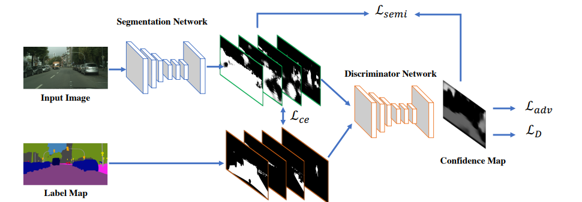

# PascalVOC-Semi-supervised-Semantic-Segmentation
Semantic segmentation is a fundamental task in computer vision, but state-of-the-art models typically demand large-scale, pixel-level annotated datasets, which are costly and labor-intensive to produce. This project
investigates the efficacy of semi-supervised learning (SSL) as a paradigm to mitigate this dependency by training models on a small set of labeled images and a large set of unlabeled images. The project implement and evaluate GAN and S4GAN model, built upon a DeepLabV3+ architecture with an EfficientNet-B2 encoder. Experiments conducted on the PASCAL VOC 2012 and Segmentation Boundary Dataset (SBD) demonstrate that most semisupervised approaches significantly outperform a baseline model trained only on the limited labeled data.

